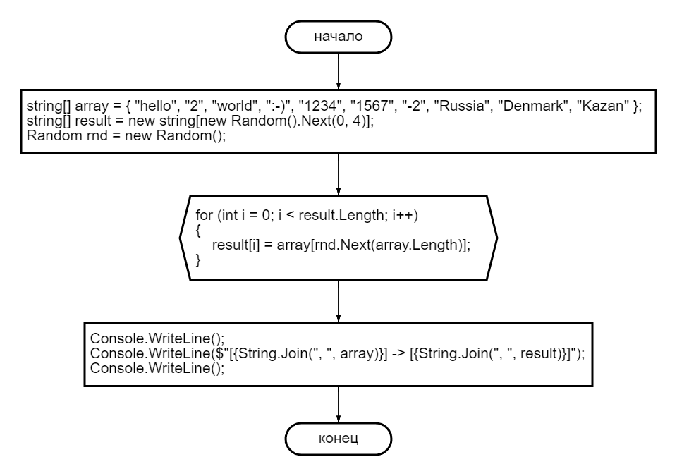

# **Итоговая проверочная работа.**

## **1. Блок-схема алгоритма.**

## **2. Описание.**
Программа, которая из имеющегося массива строк формирует массив из строк, длина которых меньше либо равна 3 символа.

*Примеры:*   
* ["hello", "2", "world", ":-)"] -> ["2", ":-)"]

* ["1234", "1567", "-2", "computer science"] -> ["-2"]

* ["Russia", "Denmark", "Kazan"] -> []

## **3. Документация.**
>  Git для профессионального программиста | Чакон Скотт, Штрауб Бен

>  C# для школьников | Мартин Дрейер
## **4. Автор.**
_Фролова Наталья Анатольевна_

## **5. Лицензия**
Copyright (C) 1988-2022